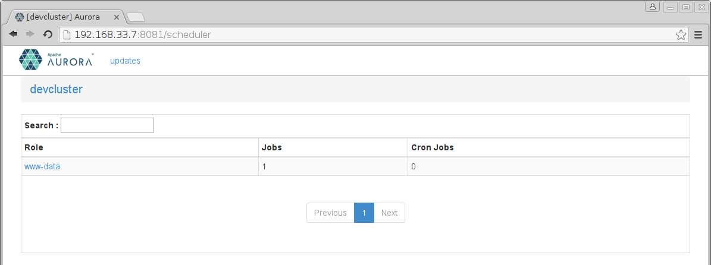
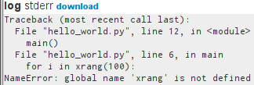
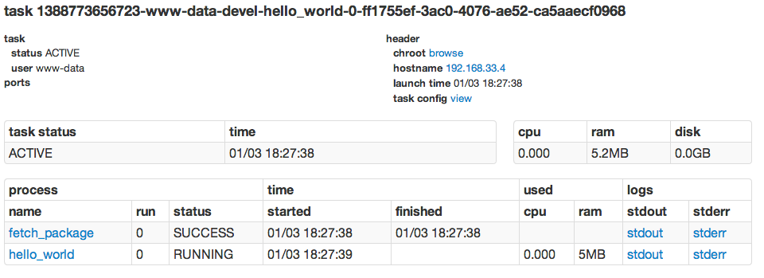

Aurora Tutorial
---------------

Before reading this document, you should read over the (short) [README](README.md)
for the Aurora docs.

- [Introduction](#introduction)
- [Setup: Install Aurora](#setup-install-aurora)
- [The Script](#the-script)
- [Aurora Configuration](#aurora-configuration)
- [What's Going On In That Configuration File?](#whats-going-on-in-that-configuration-file)
- [Creating the Job](#creating-the-job)
- [Watching the Job Run](#watching-the-job-run)
- [Cleanup](#cleanup)
- [Next Steps](#next-steps)

## Introduction

This tutorial shows how to use the Aurora scheduler to run (and
"`printf-debug`") a hello world program on Mesos. The operational
hierarchy is:

- Aurora manages and schedules jobs for Mesos to run.
- Mesos manages the individual tasks that make up a job.
- Thermos manages the individual processes that make up a task.

This is the recommended first Aurora users document to read to start
getting up to speed on the system.

To get help, email questions to the Aurora Developer List,
[dev@aurora.incubator.apache.org](mailto:dev@aurora.incubator.apache.org)

## Setup: Install Aurora

You use the Aurora client and web UI to interact with Aurora jobs. To
install it locally, see [vagrant.md](vagrant.md). The remainder of this
Tutorial assumes you are running Aurora using Vagrant.

## The Script

Our "hello world" application is a simple Python script that loops
forever, displaying the time every few seconds. Copy the code below and
put it in a file named `hello_world.py` in the root of your Aurora repository clone (Note:
this directory is the same as `/vagrant` inside the Vagrant VMs).

The script has an intentional bug, which we will explain later on.

```python
import sys
import time

def main(argv):
  SLEEP_DELAY = 10
  # Python ninjas - ignore this blatant bug.
  for i in xrang(100):
    print("Hello world! The time is now: %s. Sleeping for %d secs" % (
      time.asctime(), SLEEP_DELAY))
    sys.stdout.flush()
    time.sleep(SLEEP_DELAY)

if __name__ == "__main__":
  main(sys.argv)
```

## Aurora Configuration

Once we have our script/program, we need to create a *configuration
file* that tells Aurora how to manage and launch our Job. Save the below
code in the file `hello_world.aurora` in the same directory as your
`hello_world.py` file. (all Aurora configuration files end with `.aurora` and
are written in a Python variant).

```python
import os

# copy hello_world.py into the local sandbox
install = Process(
  name = 'fetch_package',
  cmdline = 'cp /vagrant/hello_world.py . && chmod +x hello_world.py')

# run the script
hello_world = Process(
  name = 'hello_world',
  cmdline = 'python hello_world.py')

# describe the task
hello_world_task = SequentialTask(
  processes = [install, hello_world],
  resources = Resources(cpu = 1, ram = 1*MB, disk=8*MB))

jobs = [
  Job(name = 'hello_world', cluster = 'example', role = 'www-data',
      environment = 'devel', task = hello_world_task)
]
```

For more about Aurora configuration files, see the [Configuration
Tutorial](configurationtutorial.md) and the [Aurora + Thermos
Reference](configurationreference.md) (preferably after finishing this
tutorial).

## What's Going On In That Configuration File?

More than you might think.

1. From a "big picture" viewpoint, it first defines two
Processes. Then it defines a Task that runs the two Processes in the
order specified in the Task definition, as well as specifying what
computational and memory resources are available for them.  Finally,
it defines a Job that will schedule the Task on available and suitable
machines. This Job is the sole member of a list of Jobs; you can
specify more than one Job in a config file.

2. At the Process level, it specifies how to get your code into the
local sandbox in which it will run. It then specifies how the code is
actually run once the second Process starts.

## Creating the Job

We're ready to launch our job! To do so, we use the Aurora Client to
issue a Job creation request to the Aurora scheduler.

Many Aurora Client commands take a *job key* argument, which uniquely
identifies a Job. A job key consists of four parts, each separated by a
"/". The four parts are  `<cluster>/<role>/<environment>/<jobname>`
in that order. When comparing two job keys, if any of the
four parts is different from its counterpart in the other key, then the
two job keys identify two separate jobs. If all four values are
identical, the job keys identify the same job.

`/etc/aurora/clusters.json` within the Aurora scheduler has the available
cluster names. For Vagrant, from the top-level of your Aurora repository clone,
do:

    $ vagrant ssh aurora-scheduler

Followed by:

    vagrant@precise64:~$ cat /etc/aurora/clusters.json

You'll see something like:

```javascript
[{
  "name": "example",
  "zk": "192.168.33.2",
  "scheduler_zk_path": "/aurora/scheduler",
  "auth_mechanism": "UNAUTHENTICATED"
}]
```

Use a `name` value for your job key's cluster value.

Role names are user accounts existing on the slave machines. If you don't know what accounts
are available, contact your sysadmin.

Environment names are namespaces; you can count on `prod`, `devel` and `test` existing.

The Aurora Client command that actually runs our Job is `aurora create`. It creates a Job as
specified by its job key and configuration file arguments and runs it.

    aurora create <cluster>/<role>/<environment>/<jobname> <config_file>

Or for our example:

    aurora create example/www-data/devel/hello_world /vagrant/hello_world.aurora

Note: Remember, the job key's `<jobname>` value is the name of the Job, not the name
of its code file.

This returns:

    $ vagrant ssh aurora-scheduler
    Welcome to Ubuntu 12.04 LTS (GNU/Linux 3.2.0-23-generic x86_64)

     * Documentation:  https://help.ubuntu.com/
    Welcome to your Vagrant-built virtual machine.
    Last login: Fri Jan  3 02:18:55 2014 from 10.0.2.2
    vagrant@precise64:~$ aurora create example/www-data/devel/hello_world \
        /vagrant/hello_world.aurora
     INFO] Creating job hello_world
     INFO] Response from scheduler: OK (message: 1 new tasks pending for job
      www-data/devel/hello_world)
     INFO] Job url: http://precise64:8081/scheduler/www-data/devel/hello_world

## Watching the Job Run

Now that our job is running, let's see what it's doing. Access the
scheduler web interface at `http://$scheduler_hostname:$scheduler_port/scheduler`
Or when using `vagrant`, `http://192.168.33.6:8081/scheduler`
First we see what Jobs are scheduled:



Click on your user name, which in this case was `www-data`, and we see the Jobs associated
with that role:


Uh oh, that `Unstable` next to our `hello_world` Job doesn't look good. Click the
`hello_world` Job, and you'll see:


Oops, looks like our first job didn't quite work! The task failed, so we have
to figure out what went wrong.

Access the page for our Task by clicking on its Host.


Once there, we see that the
`hello_world` process failed. The Task page captures the standard error and
standard output streams and makes them available. Clicking through
to `stderr` on the failed `hello_world` process, we see what happened.



It looks like we made a typo in our Python script. We wanted `xrange`,
not `xrang`. Edit the `hello_world.py` script, save as `hello_world_v2.py` and change your
`hello_world.aurora` config file to use `hello_world_v2.py` instead of `hello_world.py`.

Now that we've updated our configuration, let's restart the job:

    aurora update example/www-data/devel/hello_world /vagrant/hello_world.aurora

This time, the task comes up, we inspect the page, and see that the
`hello_world` process is running.



We then inspect the output by clicking on `stdout` and see our process'
output:


## Cleanup

Now that we're done, we kill the job using the Aurora client:

    vagrant@precise64:~$ aurora kill example/www-data/devel/hello_world
     INFO] Killing tasks for job: example/www-data/devel/hello_world
     INFO] Response from scheduler: OK (message: Tasks killed.)
     INFO] Job url: http://precise64:8081/scheduler/www-data/devel/hello_world
    vagrant@precise64:~$

The Task scheduler page now shows the `hello_world` process as `KILLED`.


## Next Steps

Now that you've finished this Tutorial, you should read or do the following:

- [The Aurora Configuration Tutorial](configurationtutorial.md), which provides more examples
  and best practices for writing Aurora configurations. You should also look at
  the [Aurora + Thermos Configuration Reference](configurationreference.md).
- The [Aurora User Guide](userguide.md) provides an overview of how Aurora, Mesos, and
  Thermos work "under the hood".
- Explore the Aurora Client - use the `aurora help` subcommand, and read the
  [Aurora Client Commands](clientcommands.md) document.
